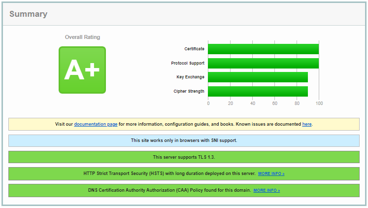
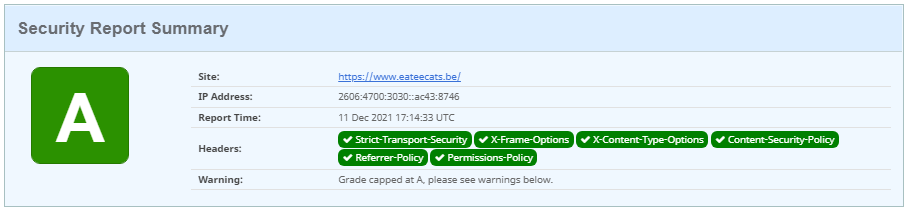
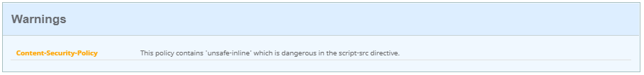

# Feedback

This is a report discussing and testing the following website: **[Eatee](https://www.eateecats.be/)**

**Team:** [Callback Cats](https://github.com/EHB-TI/web-app-callback-cats)

## Introduction

The emphasis of our testing is on safety. Since functionality, risk and security influence each other, and often even determine each other, the business logic is also expected to be tested. Is the application achieving its objectives? Is the app doing this in a safe way? The threat model of the customer can help us with this. After all, a good threat model also contains risks that are specific to the application. Do we agree with our client's risk assessment? Are the main risks being addressed in a proper manner? We will pay special attention to access rights to see if they are properly enforced? To evaluate this we need to be able to sign up with different roles.

Throughout the testing of the website the uptime was not consistent. /////

## 1. Evaluation criteria regarding registration and passwords

### **Log in and Registration:**

Users can **not** create an account in order to log in. This is a problem because the website is only available for users that are logged in. Upon visiting the website the user is prompted with a log in screen but since the users is not allowed to create an account it is impossible for a client to use the website. Demo accounts have been provided to make sure we could test the different functionalities of the website. But an outside user can not create his/her own account to access the services.  
Using the demo accounts we can navigate the different views of the website, the website clearly indicates whether the user is logged in or not and provides the functionality to log out if needed.

Since the registration is not functional, the user informations are not available. The user can not view or modify his/her personal information. Passwords can not be created which indicates that the criteria regarding password creation have not been met.

The passwords that have been provided alongside the demo accounts do not meeet the minimum requirements and are of a risky nature. The passwords do not contain any capital letters, punctuation, numbers or a defined length.

It is not possible to fully test the site, since different functionalities are missing it is nearly impossaible to discuss some of the criteria. 

### **Uncaught errors:**

> _The log in does not work on the following version of the website: https://www.eateecats.be/, the log in does work on the following modified version: https://eateecats.be/.  
> We think this occurs because the **[first](https://www.eateecats.be/)** version is a subdomain of the **[second](https://eateecats.be/)** version._

## Evaluation criteria regarding HTTPS

### **Is HTTPS used everywhere?**

All the views use HTTPS to make sure all communication and customer information is protected. Using HTTPS also prevents Man-in-the-Middle attacks.

### **SSL Labs server test:**

The server test by **[SSL Labs](https://www.ssllabs.com/ssltest/index.html)** results in a A+ mark. Each response contains a Strict-Transport-Security header;

 

### **HSTS preload list:**

The domain is present in the HSTS preload list. The following site is used to check its status: [HSTS](https://hstspreload.org/)

 

### **Security headers:**

The domain contains all the needed security headers. The following site is used to check the headers: [Security Headers](https://securityheaders.com/)

The only warning that has been detected by the site is the following:
 

