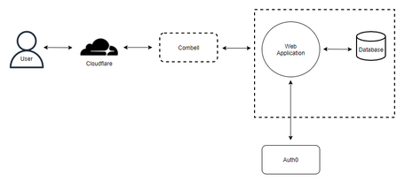

# Goal 
We will create a restaurant web application, which will also be available both on your desktop as your phone. In this app, students will be able to view the menu with all of the available products and which allergies this product has. This way, the student knows whether or not it is safe for them to consume. The students will also be able to place orders and pay in advance. To accomplish this, we will be using Stripe to manage payments and keep track of them.

The restaurant employees will be able to view all placed orders with its details. This will allow them to view, create, edit and remove menus and products. This means that the employees will have a dashboard available to them where they can easily access these statistics. Here they will be able to manage their stock, orders, menus and products.

This app will provide students with an easier way to buy their lunch, removing the need to wait in long queues. The restaurant employees will see more information about sales, stock, payments, ... This app will also reduce food waste, which allows for cost savings.

To accomplish this, we will be using JavaScript React to create and serve the website. This website will be using our own API, which will be made in NodeJS. Both of these will be running in the cloud to ensure its availability.

# Acceptance criteria
As a student I can…
* … see the menu of today
* … see the allergies, price and availability of a product/meal
* … create a sandwich with available products
* … pay my order in advance
* … log in
* … log out
* … change my password
* … update my 2-factor authentication
* … see my previous orders

As a student I receive an email when my order is ready

As a school restaurant employee I can…
* … see which orders have been placed
* … check out an order when it is ready
* … create/view/edit/remove menus
* … create/view/edit/remove products
* … check the stock

The stock changes when products are ordered and payed.
School restaurant employee is one general account for every employee working in the restaurant. This way, there doesn't have to be a new account for every new employee.
Users such as students will be be able to login via the EhB login system.

Allergies, price and amount of the product are filled in by the school restaurant employee.

# Threat model

## OWASP
| Name | Threat | Solution | Context |
| ---- | ------ | -------- | ------- |
| A01 Broken Access Control | Access control enforces users a certain policy such that they cannot act outside of their intended permissions (ex. A student is not able to create a product). | Properly implement authentication and access restrictions (deny by default) on all pages. | Frontend. |
| A02 Cryptographic Failures | Using cryptography incorrectly (or implementing it wrongly) can result in exposing sensitive data. | All data gets encrypted and only data that is needed on a certain page will be available. | Front-end and backend. |
| A03 Injection | Hostile data is injected to access unauthorized data. | Using HTML standard validation (eg. email validation). Stripping special characters from user input and writing parameterized queries. Validating input in the backend with trusted and recommended libraries. | Forms standard validation happens in the front-end. Stripping, parameterized queries and validation happens in the backend. |
| A04 Insecure Design | Insecure design is a broad category representing different weaknesses, expressed as “missing or ineffective control design.” | Use of independent components. | Front-end. |
| A05 Security Misconfiguration | Improper configured permissions. | User permissions are checked on both frontend and backend. | Front-end and backend API. |
| A06 Vulnerable and Outdated Components | Use of outdated dependencies. | Use of officially recognised and recommended libraries and software only. | Front-end and backend API. |
| A07 Identification and Authentication Failures | Confirmation of the user's identity, authentication, and session management is critical to protect against authentication-related attacks. | Two-Factor authentication. ReCAPTCHA to prevent use of bots. Maximum amount of logins (3). | Front-end and backend API. |
| A08 Software and Data Integrity Failures | Software and data integrity failures relate to code and infrastructure that does not protect against integrity violations. | Use of dependabot, use of github branches and code gets checked by another team member. | Github |
| A09 Security Logging and Monitoring Failures | Help detect, escalate, and respond to active breaches. Without logging and monitoring, breaches cannot be detected. | Log all kinds of failures (login, access control, input validation, …). | Front-end and backend API. |
| A10 Server Side Request Forgery | SSRF flaws occur whenever a web application is fetching a remote resource without validating the user-supplied URL. It allows an attacker to coerce the application to send a crafted request to an unexpected destination, even when protected by a firewall, VPN, or another type of network access control list (ACL). | Use of csrf. | Front-end and backend API.

## STRIDE
| Threat | Property violated | Threat | Solution |
| ------ | ----------------- | ------ | -------- |
| Spoofing | Authenticity | A user takes on a different identity than itself, like that of an administrator. | Two factor authentication, encrypting passwords |
| Tampering | Integrity | An attacker can change information about the system like the cost of a product. | Permissions |
| Repudiation | Non-repudiability | Repudiation means that an attacker deletes or changes a transaction in an attempt to refute that it ever happened. | Logging |
| Information disclosure | Confidentiality | Sensitive information can be stolen by an attacker and sold in order to profit. | Permissions, encryption, SSL |
| Denial of Service | Availability | The system can be overwhelmed resulting in the server going offline. | Protection by Cloudflare/Combell |
| Elevation of Privilege | Authorization | When an attacker tries to take on the identity of a higher level account in order to get more permissions. | Authorization, using roles with permissions |

## Specific threats
| Threat | Solution | 
| ------ | -------- |
| Correct/valid payment | Stripe will manage the payments and its security |
| Manage authentication/authorization for who can read/write data | OAuth will provide security for the authorization/authentication. |
| Man in the middle attack | The application will be using HTTPS to prevent these attacks. |

# Deployment
*minimally, this section contains a public URL of the app. A description of how your software is deployed is a bonus. Do you do this manually, or did you manage to automate? Have you taken into account the security of your deployment process?*

https://www.eateecats.be

# *you may want further sections*
*especially if the use of your application is not self-evident*

